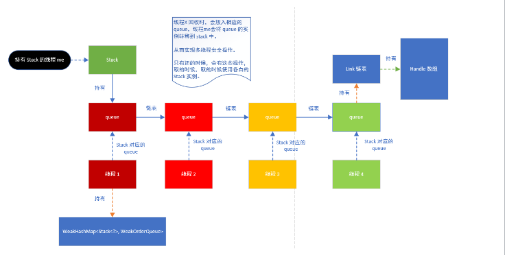

Netty是如今互联网最流行的java通讯库，在众多优秀组件 dubbo,grpc-java,jetty,RocketMQ中都使用了netty作为其通讯组件。
在netty的使用中，最常见的就是ByteBuf类，这个类最常见是由于其是**字节数据的容器**，白话一点就是存放字节数据的数组。
因为所有的网络通信最终都是基于底层的字节流传输，所以需要一个方便、易用的数据接口进行字节流的基本操作，正好ByteBuf提供了
基础的操作。
### ByteBuf 三种类型
1. 堆缓充区
此类型ByteBuf将数据存在JVM的堆空间。以非池化的堆内存为例 UnpooledHeapByteBuf，阅读源码其中使用 byte[] array作为数据存储，很显然数据在堆内存，所以在其作为IO输出到socket或者file时，显然效率是不如堆外内存的，这里面的知识详情见附录，涉及经常被提及的零拷贝的概念。
2. 直接缓冲区
此类型ByteBuf将数据存在JVM的堆外内存，注意：这里的堆外内存依然是用户态的内存不是内核态的内存映射。为什么要使用堆外内存，这里面的知识也是涉及附录知识点。以非池化的直接缓冲区为例 UnpooledDirectByteBuf，阅读源码其使用 ByteBuffer的DirectByteBuffer直接内存作为数据存储，采用装饰者模式进行装饰性封装。
3.复合缓冲区
此类型ByteBuf是用于**避免重复内存拷贝**而设计的，CompositeByteBuf类来处理复合缓冲区，但其只是一个视图，何为视图，白话一点就是其是一个装饰者，封装了底层实现用来让api调用者用起来以为是一个ByteBuf缓冲区而不是同时操作多个缓冲区。避免重复内存以及之间的拷贝也是涉及附录知识点。复合缓冲区就像一个组件列表，组件就是Bytebuf，我们可以动态的往其中加入和删除Bytebuf

### ByteBuf 归属
1. 非池化  
非池化根据类型分为堆内存和非堆内存，堆内存是jvm管理之下的内存，非堆内存也叫本地内存，在jvm管理之外，也就是说不在gc管理之下，那么需要人工释放（java程序员习惯了不管内存，这里需要回归内存基本的操作）。非池化其实本质上就是需要时就去new一个，既然ByteBuf有堆和非堆，那么很显然Unpooled涉及UnpooledHeapByteBuf和UnpooledDirectByteBuf，目前源码中有几个为了强化性能而编写的拓展类：
UnpooledUnsafeDirectByteBuf和UnpooledUnsafeNoCleanerDirectByteBuf，内部使用了Unsafe进行高性能的get/set操作，为何高性能这里涉及Unsafe操作本地方法，NoCleaner涉及操作直接内存（非堆）时使用Unsafe本地方法创建和释放DirectByteBuffer不使用JDK内部实现的DirectByteBuffer创建和释放，因为JDK内部的DirectByteBuffer内部实现了Cleaner机制来释放内存，所以这里直接操作内存叫NoCleaner，这样做有两个好处：1.屏蔽了不同版本JDK的实现差异，但违背了跨平台特性。2.高性能直接操作内存，适配高并发场景。
那么此处以UnpooledUnCleanerDirectByteBuf和PlatformDependent为例分析下高性能部分的源码：
```java
    // UnpooledUnCleanerDirectByteBuf 内部源码
    @Override
     protected ByteBuffer allocateDirect(int initialCapacity) {
         return PlatformDependent.allocateDirectNoCleaner(initialCapacity);
     }

     ByteBuffer reallocateDirect(ByteBuffer oldBuffer, int initialCapacity) {
         return PlatformDependent.reallocateDirectNoCleaner(oldBuffer, initialCapacity);
     }

     @Override
     protected void freeDirect(ByteBuffer buffer) {
         PlatformDependent.freeDirectNoCleaner(buffer);
     }
     // PlatformDependent 内部源码
    public static ByteBuffer allocateDirectNoCleaner(int capacity) {
        assert USE_DIRECT_BUFFER_NO_CLEANER;

        incrementMemoryCounter(capacity);
        try {
            // PlatformDependent0内部采用Unsafe和反射直接创建DirectBuffer(address, capacity)
            return PlatformDependent0.allocateDirectNoCleaner(capacity);
        } catch (Throwable e) {
            decrementMemoryCounter(capacity);
            throwException(e);
            return null;
        }
    }

    public static ByteBuffer reallocateDirectNoCleaner(ByteBuffer buffer, int capacity) {
        assert USE_DIRECT_BUFFER_NO_CLEANER;

        int len = capacity - buffer.capacity();
        incrementMemoryCounter(len);
        try {
            // PlatformDependent0内部采用Unsafe和反射重新创建DirectBuffer(address, capacity)
            return PlatformDependent0.reallocateDirectNoCleaner(buffer, capacity);
        } catch (Throwable e) {
            decrementMemoryCounter(len);
            throwException(e);
            return null;
        }
    }

    public static void freeDirectNoCleaner(ByteBuffer buffer) {
        assert USE_DIRECT_BUFFER_NO_CLEANER;

        int capacity = buffer.capacity();
        // PlatformDependent0内部采用Unsafe直接释放address
        PlatformDependent0.freeMemory(PlatformDependent0.directBufferAddress(buffer));
        decrementMemoryCounter(capacity);
    }
```
2. 池化  
所谓池化就是一个众多ByteBuf的重复利用缓存区，既然是重复利用，那么就会涉及回收和获取：**release** and **get**。
那么是如何进行缓存和这些一系列操作的呢？进行源码阅读**Recycler类**是核心类实现，这里涉及的知识点比较多首先看下数据结构图：

如果阅读过Recycle类源码可能感觉有种醍醐灌顶的感觉，但是如果不熟悉Recycle类源码可能就会感觉不知所云。读懂数据结构其实就是读懂算法和相关设计原理，这是作为工程类程序员必备的技能之一。接下来我们重点分析下源码细节：
```java
    /**
        轻量级的对象池 通过 stack存储 而且 stack是thread-local性质的，也就是说每个线程单独调用属于自己的Stack，操作自己的 stack 进行 pop 和 push进行回收和获取
     * Light-weight object pool based on a thread-local stack.
     *
     * @param <T> the type of the pooled object
     */
    public abstract class Recycler<T> {
      // FastThreadLocal变量，里面存储Stack变量，FastThreadLocal类功能类似于ThreadLocal，里面封装了ThreadLocal
      private final FastThreadLocal<Stack<T>> threadLocal = new FastThreadLocal<Stack<T>>() {
      @Override
      protected Stack<T> initialValue() {
          return new Stack<T>(Recycler.this, Thread.currentThread(), maxCapacityPerThread, maxSharedCapacityFactor,
                  ratioMask, maxDelayedQueuesPerThread);
                }
      };

      // 获取数据的入口
      public final T get() {
        if (maxCapacityPerThread == 0) {
            return newObject((Handle<T>) NOOP_HANDLE);
        }
        Stack<T> stack = threadLocal.get();
        DefaultHandle<T> handle = stack.pop();
        if (handle == null) {
            // 新建一个handle
            handle = stack.newHandle();
            // 去回调实现类实现的方法
            handle.value = newObject(handle);
        }
        return (T) handle.value;
      }

      static final class DefaultHandle<T> implements Handle<T> {
          @Override
          // 回收数据的入口，在内部类当中，在内部类当中如何进行调用呢？接下来我们进一步分析netty有关ByteBuf对象回收的相关源码
          public void recycle(Object object) {
              if (object != value) {
                  throw new IllegalArgumentException("object does not belong to handle");
              }
              stack.push(this);
          }
      }

      // 这是一个抽象方法，需要用到Recycler类的代码类比如PooledDirectByteBuf类去实现这个方法，这里传进一个Handle，按照一般的代码设计思路，这里很显然是用来回调的，实现类去实现，上层Recycler类的地方去回调它，也就是说handle变量是在Recycler内部赋值且传入的，其实赋值的源码就在上面的get的函数里面
      protected abstract T newObject(Handle<T> handle);

    }

    // PooledDirectByteBuf类部分源码解析
    final class PooledDirectByteBuf extends PooledByteBuf<ByteBuffer> {

    private static final Recycler<PooledDirectByteBuf> RECYCLER = new Recycler<PooledDirectByteBuf>() {
        @Override
        protected PooledDirectByteBuf newObject(Handle<PooledDirectByteBuf> handle) {
            // 将Recycler类赋值的handle进行构造参数进行类的初始化
            return new PooledDirectByteBuf(handle, 0);
        }
    };

    static PooledDirectByteBuf newInstance(int maxCapacity) {
        // 调用Recycler去实现获取对象
        PooledDirectByteBuf buf = RECYCLER.get();
        buf.reuse(maxCapacity);
        return buf;
    }

    private PooledDirectByteBuf(Recycler.Handle<PooledDirectByteBuf> recyclerHandle, int maxCapacity) {
        // 继续赋值给上层父类，为什么这样做呢，接下来进一步分析源码
        super(recyclerHandle, maxCapacity);
      }
    }

    abstract class PooledByteBuf<T> extends AbstractReferenceCountedByteBuf {
      // 这里就是赋值Handle的地方
      protected PooledByteBuf(Recycler.Handle<? extends PooledByteBuf<T>> recyclerHandle, int maxCapacity) {
          super(maxCapacity);
          this.recyclerHandle = (Handle<PooledByteBuf<T>>) recyclerHandle;
      }

      // 实现的AbstractReferenceCountedByteBuf的接口，内部调用recycle函数
      @Override
      protected final void deallocate() {
          if (handle >= 0) {
              final long handle = this.handle;
              this.handle = -1;
              memory = null;
              tmpNioBuf = null;
              chunk.arena.free(chunk, handle, maxLength, cache);
              chunk = null;
              recycle();
          }
      }
      // 回收封装函数
      private void recycle() {
          recyclerHandle.recycle(this);
      }
    }
    public abstract class AbstractReferenceCountedByteBuf extends AbstractByteBuf {
          @Override
          // 回收的入口，暴露出的API调用处
          public boolean release(int decrement) {
              return release0(checkPositive(decrement, "decrement"));
          }

          private boolean release0(int decrement) {
              for (;;) {
                  int refCnt = this.refCnt;
                  if (refCnt < decrement) {
                      throw new IllegalReferenceCountException(refCnt, -decrement);
                  }

                  if (refCntUpdater.compareAndSet(this, refCnt, refCnt - decrement)) {
                      if (refCnt == decrement) {
                          // 调用释放实现函数，就是上文的回收的调用处
                          deallocate();
                          return true;
                      }
                      return false;
                  }
              }
          }
    }
```
