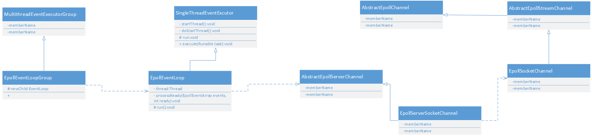

Epoll是Linux系统中高性能IO的底层机制，由操作系统底层内核提供，Linux版本在2.6之后的版本才会有此功能及api暴露出来，应用层一般采用c或c++去编写。
本文主要讲述Netty源码中Epoll的实现原理和源码设计思想。
#### Epoll 例子 c语言
先来一段实例代码：
``` c
  #include <iostream>
  #include <sys/socket.h> 
  #include <sys/epoll.h>
  #include <netinet/in.h> 
  #include <arpa/inet.h>
  #include <fcntl.h> 
  #include <unistd.h> 
  #include <stdio.h>
   
  #define MAXLINE 10 
  #define OPEN_MAX 100
  #define LISTENQ 20
  #define SERV_PORT 5555 
  #define INFTIM 1000

  void setnonblocking(int sock)
  {
     int opts;
     opts = fcntl(sock, F_GETFL);
     if(opts < 0)
     {
        perror("fcntl(sock, GETFL)");
        exit(1);
     }
     opts = opts | O_NONBLOCK;
     if(fcntl(sock, F_SETFL, opts) < 0)
     {
        perror("fcntl(sock,SETFL,opts)");
        exit(1);
     }
  }

  int main()
  {
     int i, maxi, listenfd, connfd, sockfd, epfd, nfds; 
     ssize_t n; 
     char line[MAXLINE];
     socklen_t clilen;
     //声明epoll_event结构体的变量, ev用于注册事件, events数组用于回传要处理的事件
     struct epoll_event ev,events[20];
     //生成用于处理accept的epoll专用的文件描述符, 指定生成描述符的最大范围为256 
     epfd = epoll_create(256);
     struct sockaddr_in clientaddr; 
     struct sockaddr_in serveraddr;
     listenfd = socket(AF_INET, SOCK_STREAM, 0);
   
     setnonblocking(listenfd);       //把用于监听的socket设置为非阻塞方式
     ev.data.fd = listenfd;          //设置与要处理的事件相关的文件描述符
     ev.events = EPOLLIN | EPOLLET;  //设置要处理的事件类型
     epoll_ctl(epfd, EPOLL_CTL_ADD, listenfd, &ev);     //注册epoll事件
     bzero(&serveraddr, sizeof(serveraddr)); 
     serveraddr.sin_family = AF_INET;
     char* local_addr = "200.200.200.204";
     inet_aton(local_addr, &(serveraddr.sin_addr));
     serveraddr.sin_port = htons(SERV_PORT);  //或者htons(SERV_PORT);
     bind(listenfd,(sockaddr *)&serveraddr, sizeof(serveraddr));
     listen(listenfd, LISTENQ);

     maxi = 0;
     for( ; ; )
     { 
        nfds = epoll_wait(epfd, events, 20, 500); //等待epoll事件的发生
        for(i = 0; i < nfds; ++i)                 //处理所发生的所有事件
        {
           if(events[i].data.fd == listenfd)      //监听事件
           {
              connfd = accept(listenfd, (sockaddr *)&clientaddr, &clilen); 
              if(connfd < 0)
              {
                 perror("connfd<0");
                 exit(1);
              }
              setnonblocking(connfd);           //把客户端的socket设置为非阻塞方式
              char* str = inet_ntoa(clientaddr.sin_addr);
              std::cout << "connect from " << str  <<std::endl;
              ev.data.fd=connfd;                //设置用于读操作的文件描述符
              ev.events=EPOLLIN | EPOLLET;      //设置用于注测的读操作事件
              epoll_ctl(epfd, EPOLL_CTL_ADD, connfd, &ev);
              //注册ev事件
           }
           else if(events[i].events&EPOLLIN)      //读事件
           {
              if ( (sockfd = events[i].data.fd) < 0)
              {
                 continue;
              }
              if ( (n = read(sockfd, line, MAXLINE)) < 0) // 这里和IOCP不同
              {
                 if (errno == ECONNRESET)
                 {
                    close(sockfd);
                    events[i].data.fd = -1; 
                 }
                 else
                 {
                    std::cout<<"readline error"<<std::endl;
                 }
              }
              else if (n == 0)
              {
                 close(sockfd); 
                 events[i].data.fd = -1; 
              }
              ev.data.fd=sockfd;              //设置用于写操作的文件描述符
              ev.events=EPOLLOUT | EPOLLET;   //设置用于注测的写操作事件 
              //修改sockfd上要处理的事件为EPOLLOUT
              epoll_ctl(epfd, EPOLL_CTL_MOD, sockfd, &ev);
           } 
           else if(events[i].events&EPOLLOUT)//写事件
           {
              sockfd = events[i].data.fd;
              write(sockfd, line, n);
              ev.data.fd = sockfd;               //设置用于读操作的文件描述符
              ev.events = EPOLLIN | EPOLLET;     //设置用于注册的读操作事件
              //修改sockfd上要处理的事件为EPOLIN
              epoll_ctl(epfd, EPOLL_CTL_MOD, sockfd, &ev);
           } 
        }
     }
  }
```
作为java程序员对c程序可能不需要编写，毕竟底层已经都已经封装好了，但是底层需要去懂，不要求c写的很老练但要求能读懂c代码，代码处有c代码的注释，简单来说是三个重要函数，epoll_create,epoll_wait,epoll_ctl 这是操作系统的接口函数，具体内部源码解析参考这篇文章：
[epoll源码解析](https://www.cnblogs.com/apprentice89/p/3234677.html)
#### Netty Epoll源码解析
对于源码分析，笔者最喜欢做的就是画出uml图，这是软件工程的基本功。

首先解释下为啥从epoll开始进行，因为在目前的服务端程序中，调用epoll进行服务端是首选，即使是JDK自带的NioServerSocket从源码来看也是优选epoll功能。netty的很多源码是重写的JDK代码，大量采用底层c函数，这其中就包括epoll中部分的代码实现（Native类中），也就是说epoll函数重要的三个函数其实是由c实现的，阅读其源码，和上述的c代码本质相同，大部分的逻辑其实在java代码中。我们先从ServerBootstrap开始分析，首先看下一般的服务端引导是如何编写的。
```java
public void start() throws Exception {
  EpollEventLoopGroup parentGroup = new EpollEventLoopGroup(); // 新建一个Epoll监听事件轮询组
  EpollEventLoopGroup childGroup = newEpollEventLoopGroup(); // 新建一个Epoll处理连接的事件轮询组
  Epoll
  try {
    ServerBootstrap b = new ServerBootstrap();
    b.group(parentGroup, childGroup) //将parent，child赋值给服务器引导
    .channel(EpollServerSocketChannel.class) //设置服务端通道为EpollServer类型
    .localAddress(new InetSocketAddress(port)) //设置绑定的服务端地址
    .childHandler(new ChannelInitializer<SocketChannel>() { // 初始化处理每个客户端io的通道
      @Override
      public void initChannel(SocketChannel ch)
      throws Exception {
        ch.pipeline().addLast(
        new EchoServerHandler()); // 设置编解码类
      }
    });
    ChannelFuture f = b.bind().sync(); // 开始服务的入口函数（下面在源码解析的时候提及）
    System.out.println(EchoServer.class.getName() + " started and listen on "
    + f.channel().localAddress());
    f.channel().closeFuture().sync(); // 关闭服务通道
  } finally {
    group.shutdownGracefully().sync(); // 优雅地关闭事件轮询组
  }
}
```
