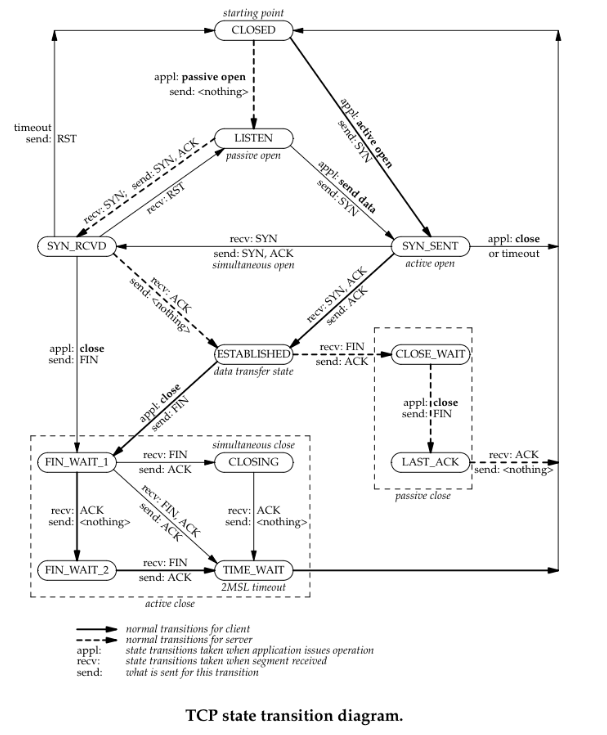
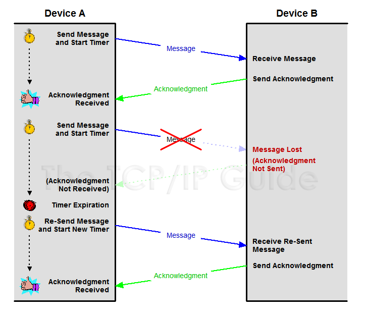
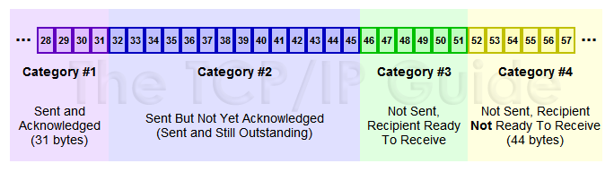
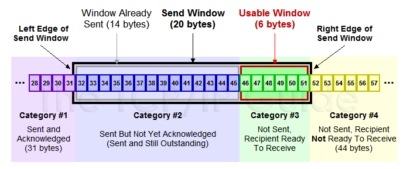
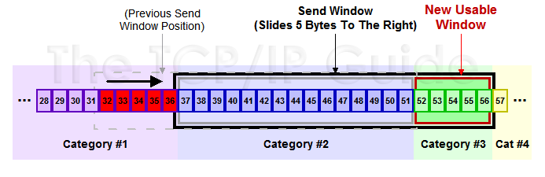

TCP协议详解
众所周知，TCP协议是一个**可靠的**的协议，也是一个**流量控制**协议
### TCP协议可靠性中的那些超时
TCP的可靠性依赖于大量的 Timer 和 Retransmission 。现在咱们就来细说一下TCP协议的那些 Timer 。

#### Connection-Establishment Timer

在TCP三次握手创建一个连接时，以下两种情况会发生超时：

client发送SYN后，进入SYN_SENT状态，等待server的SYN+ACK。
server收到连接创建的SYN，回应SYN+ACK后，进入SYN_RECD状态，等待client的ACK。
当超时发生时，就会重传，一直到75s还没有收到任何回应，便会放弃，终止连接的创建。但是在Linux实现中，并不是依靠超时总时间来判断是否终止连接。而是依赖重传次数：

>tcp_syn_retries (integer; default: 5; since Linux 2.2)

>The maximum number of times initial SYNs for an active TCP connection attempt will be retransmitted. This value should not be higher than 255. The default value is 5, which corresponds to approximately 180 seconds.

>tcp_synack_retries (integer; default: 5; since Linux 2.2)

>The maximum number of times a SYN/ACK segment for a passive TCP connection will be retransmitted. This number should not be higher than 255.

#### Retransmission Timer
当三次握手成功，连接建立，发送TCP segment，等待ACK确认。如果在指定时间内，没有得到ACK，就会重传，一直重传到放弃为止。Linux中也有相关变量来设置这里的重传次数的：

>tcp_retries1 (integer; default: 3; since Linux 2.2)

>The number of times TCP will attempt to retransmit a packet on an established connection normally, without the extra effort of getting the network layers involved. Once we exceed this number of retransmits, we first have the network layer update the route if possible before each new retransmit. The default is the RFC specified minimum of 3.

>tcp_retries2 (integer; default: 15; since Linux 2.2)

>The maximum number of times a TCP packet is retransmitted in established state before giving up. The default value is 15, which corresponds to a duration of approxi‐mately between 13 to 30 minutes, depending on the retransmission timeout. The RFC 1122 specified minimum limit of 100 seconds is typically deemed too short.

#### Delayed ACK Timer
当一方接受到TCP segment，需要回应ACK。但是不需要 立即 发送，而是等上一段时间，看看是否有其他数据可以 捎带 一起发送。这段时间便是 Delayed ACK Timer ，一般为200ms。

#### Persist Timer
如果某一时刻，一方发现自己的 socket read buffer 满了，无法接受更多的TCP data，此时就是在接下来的发送包中指定通告窗口的大小为0，这样对方就不能接着发送TCP data了。如果socket read buffer有了空间，可以重设通告窗口的大小在接下来的 TCP segment 中告知对方。可是万一这个 TCP segment 不附带任何data，所以即使这个segment丢失也不会知晓（ACKs are not acknowledged, only data is acknowledged）。对方没有接受到，便不知通告窗口的大小发生了变化，也不会发送TCP data。这样双方便会一直僵持下去。

TCP协议采用这个机制避免这种问题：对方即使知道当前不能发送TCP data，当有data发送时，过一段时间后，也应该尝试发送一个字节。这段时间便是 Persist Timer 。

#### Keepalive Timer
TCP socket 的 SO_KEEPALIVE option，主要适用于这种场景：连接的双方一般情况下没有数据要发送，仅仅就想尝试确认对方是否依然在线。目前vipbar网吧，判断当前客户端是否依然在线，就用的是这个option。

具体实现方法：TCP每隔一段时间（tcp_keepalive_intvl）会发送一个特殊的 Probe Segment，强制对方回应，如果没有在指定的时间内回应，便会重传，一直到重传次数达到 tcp_keepalive_probes 便认为对方已经crash了。

>tcp_keepalive_intvl (integer; default: 75; since Linux 2.4)

>The number of seconds between TCP keep-alive probes.

>tcp_keepalive_probes (integer; default: 9; since Linux 2.2)

>The maximum number of TCP keep-alive probes to send before giving up and killing the connection if no response is obtained from the other end.

>tcp_keepalive_time (integer; default: 7200; since Linux 2.2)

>The number of seconds a connection needs to be idle before TCP begins sending out keep-alive probes. Keep-alives are only sent when the SO_KEEPALIVE socket option is enabled. The default value is 7200 seconds (2 hours). An idle connection is terminated after approximately an additional 11 minutes (9 probes an interval of 75 sec‐onds apart) when keep-alive is enabled.

>Note that underlying connection tracking mechanisms and application timeouts may be much shorter.

#### FIN_WAIT_2 Timer
当主动关闭方想关闭TCP connection，发送FIN并且得到相应ACK，从FIN_WAIT_1状态进入FIN_WAIT_2状态，此时不能发送任何data了，只等待对方发送FIN。可以万一对方一直不发送FIN呢？这样连接就一直处于FIN_WAIT_2状态，也是很经典的一个DoS。因此需要一个Timer，超过这个时间，就放弃这个TCP connection了。

>tcp_fin_timeout (integer; default: 60; since Linux 2.2)

>This specifies how many seconds to wait for a final FIN packet before the socket is forcibly closed. This is strictly a violation of the TCP specification, but required to prevent denial-of-service attacks. In Linux 2.2, the default value was 180.

#### TIME_WAIT Timer
TIME_WAIT Timer存在的原因和必要性，主要是两个方面：

主动关闭方发送了一个ACK给对方，假如这个ACK发送失败，并导致对方重发FIN信息，那么这时候就需要TIME_WAIT状态来维护这次连接，因为假如没有TIME_WAIT，当重传的FIN到达时，TCP连接的信息已经不存在，所以就会重新启动消息应答，会导致对方进入错误的状态而不是正常的终止状态。假如主动关闭方这时候处于TIME_WAIT，那么仍有记录这次连接的信息，就可以正确响应对方重发的FIN了。
一个数据报在发送途中或者响应过程中有可能成为残余的数据报，因此必须等待足够长的时间避免新的连接会收到先前连接的残余数据报，而造成状态错误。
但是我至今疑惑的是：为什么这个超时时间的值为2MSL？如果为了保证双方向的TCP包要么全部响应完毕，要么全部丢弃不对新连接造成干扰，这个时间应该是：

被动关闭方LAST_ACK的超时时间 + 1MSL

因为被动关闭方进入LAST_ACK状态后，假设一直没有收到最后一个ACK，会一直重传FIN，一直重传次数到达TCP_RETRIES放弃，将这个时间定义为「被动关闭方LAST_ACK的超时时间」，接着必须等待最后一个重传的FIN失效，需要一个MSL的时间。这样才能保证所有重传的FIN包失效，不干扰新连接吧。

### TCP协议流量控制中的滑动窗口
滑动窗口的引入
IP层协议属于不可靠的协议，IP层并不关系数据是否发送到了对端，TCP通过确认机制来保证数据传输的可靠性，在比较早的时候使用的是send--wait--send的模式，其实这种模式叫做stop-wait模式，发送数据方在发送数据之后会启动定时器，但是如果数据或者ACK丢失，那么定时器到期之后，收不到ACK就认为发送出现状况，要进行重传。这样就会降低了通信的效率，如下图所示，这种方式被称为 positive acknowledgment with retransmission (PAR)

滑动窗口
可以假设一下，来优化一下PAR效率低的缺点，比如发送的每一个包都有一个id，接收端必须对每一个包进行确认，这样设备A一次多发送几个片段，而不必等候ACK，同时接收端也要告知它能够收多少，这样发送端发起来也有个限制，当然还需要保证顺序性，不要乱序，对于乱序的状况，我们可以允许等待一定情况下的乱序，比如说先缓存提前到的数据，然后去等待需要的数据，如果一定时间没来就DROP掉，来保证顺序性！

在TCP/IP协议栈中，滑动窗口的引入可以解决PAR效率低，先来看从概念上数据分为哪些类

#### 发送缓存区
1. Sent and Acknowledged：这些数据表示已经发送成功并已经被确认的数据，比如图中的前31个bytes，这些数据其实的位置是在窗口之外了，因为窗口内顺序最低的被确认之后，要移除窗口，实际上是窗口进行合拢，同时打开接收新的带发送的数据

2. Send But Not Yet Acknowledged：这部分数据称为发送但没有被确认，数据被发送出去，没有收到接收端的ACK，认为并没有完成发送，这个属于窗口内的数据。

3. Not Sent，Recipient Ready to Receive：这部分是尽快发送的数据，这部分数据已经被加载到缓存中，也就是窗口中了，等待发送，其实这个窗口是完全有接收方告知的，接收方告知还是能够接受这些包，所以发送方需要尽快的发送这些包

4. Not Sent，Recipient Not Ready to Receive： 这些数据属于未发送，同时接收端也不允许发送的，因为这些数据已经超出了发送端所接收的范围

#### 接受缓存区
对于接收端也是有一个接收窗口的，类似发送端，接收端的数据有3个分类，因为接收端并不需要等待ACK所以它没有类似的接收并确认了的分类，情况如下

1.  Received and ACK Not Send to Process：这部分数据属于接收了数据但是还没有被上层的应用程序接收，也是被缓存在窗口内

2.  （开启delay ack的前提）Received  Not ACK: 已经接收并，但是还没有回复ACK，这些包可能输属于Delay ACK的范畴了

3.  Not Received, Ready to Receive ：有空位，还没有被接收的数据。（接受窗口）

4. Not Received, Not Ready to Receive

**需要有一点注意的就是缓存是比滑动窗口要大，因为一直存在一个区域为不发送也不允许发送或者不接受也不准备接受**

#### 发送窗口和可用窗口

对于发送方来讲，窗口内的包括两部分，就是**发送窗口**（已经发送了，但是没有收到ACK），**可用窗口**，**接收端允许发送但是没有发送的那部分称为可用窗口**。

1. Send Window ： 20个bytes 这部分值是有接收方在三次握手的时候进行通告的，同时在接收过程中也不断的通告可以发送的窗口大小，来进行适应

2. Window Already Sent: 已经发送的数据，但是并没有收到ACK。

滑动窗口原理
TCP并不是每一个报文段都会回复ACK的，可能会对两个报文段发送一个ACK，也可能会对多个报文段发送1个ACK【累计ACK】，比如说发送方有1/2/3 3个报文段，先发送了2,3 两个报文段，但是接收方期望收到1报文段，这个时候2,3报文段就只能放在缓存中等待报文1的空洞被填上，如果报文1，一直不来，报文2/3也将被丢弃，如果报文1来了，那么会发送一个ACK对这3个报文进行一次确认。

举一个例子来说明一下滑动窗口的原理：

1. 假设32~45 这些数据，是上层Application发送给TCP的，TCP将其分成四个Segment来发往internet

2. seg1 32~34 seg2 35~36 seg3 37~41 seg4 42~45  这四个片段，依次发送出去，此时假设接收端之接收到了seg1 seg2 seg4

3. 此时接收端的行为是回复一个ACK包说明已经接收到了32~36的数据，并将seg4进行缓存（保证顺序，产生一个保存seg3 的hole）

4. 发送端收到ACK之后，就会将32~36的数据包从发送并没有确认切到发送已经确认，提出窗口，这个时候窗口向右移动

5. 假设接收端通告的Window Size仍然不变，此时窗口右移，产生一些新的空位，这些是接收端允许发送的范畴

6. 对于丢失的seg3，如果超过一定时间，TCP就会重新传送（重传机制），重传成功会seg3 seg4一块被确认，不成功，seg4也将被丢弃

就是不断重复着上述的过程，随着窗口不断滑动，将真个数据流发送到接收端，实际上接收端的Window Size通告也是会变化的，接收端根据这个值来确定何时及发送多少数据，从对数据流进行流控。原理图如下图所示：

滑动窗口动态调整
主要是根据接收端的接收情况，动态去调整Window Size，然后来控制发送端的数据流量

客户端不断快速发送数据，服务器接收相对较慢，看下实验的结果

a. 包175，发送ACK携带WIN = 384，告知客户端，现在只能接收384个字节

b. 包176，客户端果真只发送了384个字节，Wireshark也比较智能，也宣告TCP Window Full

c. 包177，服务器回复一个ACK，并通告窗口为0，说明接收方已经收到所有数据，并保存到缓冲区，但是这个时候应用程序并没有接收这些数据，导致缓冲区没有更多的空间，故通告窗口为0, 这也就是所谓的零窗口，零窗口期间，发送方停止发送数据

d. 客户端察觉到窗口为0，则不再发送数据给接收方

e. 包178，接收方发送一个窗口通告，告知发送方已经有接收数据的能力了，可以发送数据包了

f.  包179，收到窗口通告之后，就发送缓冲区内的数据了.

总结一点，就是接收端可以根据自己的状况通告窗口大小，从而控制发送端的发送，进行流量控制
